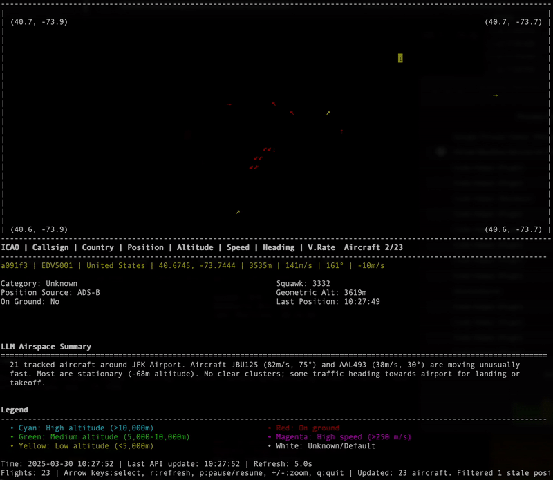

# ADS-B Flight Tracker

A terminal-based real-time flight tracker using ADS-B data from the OpenSky Network API.


_Realtime ADS-B monitoring near JFK, showing aircraft lined up to takeoff/landing, demonstrating zooming in/out, and LLM integration._

## Features

- Real-time monitoring of aircraft in a specified area
- Detailed aircraft information display (position, altitude, speed, heading, etc.)
- Color-coded aircraft visualization based on altitude and ground status
- Airport-based tracking with configurable radius
- Support for OpenSky Network API authentication
- Interactive controls for navigation and view adjustment
- Comprehensive logging system
- Optional LLM integration for airspace summaries using Ollama

## Requirements

- Python 3.10+
- `requests` library
- `curses` library (included in Python standard library)
- Optional: Ollama for LLM integration

## Installation

1. Clone the repository:
   ```
   git clone https://github.com/b-d055/adsb-copilot.git
   cd adsb-copilot
   ```

2. Install the required packages:
   ```
   pip install -r requirements.txt
   ```

3. (Optional) Download the updated airports database if needed:
   Download `airports.csv` from [OurAirports](https://ourairports.com/data/) and place it in the application directory.

## Usage

### Basic Usage

Run the flight tracker with default settings (tracking Swiss airspace):

```
python main.py
```

### Track Flights Around a Specific Airport

```
python main.py --airport JFK --radius 30
```

### Custom Geographic Bounds

```
python main.py --min-lat 40.5 --max-lat 41.0 --min-lon -74.0 --max-lon -73.5
```

### Use OpenSky Network API Authentication

```
python main.py --username yourusername --password yourpassword
```

### Enable LLM Integration for Airspace Summaries

This requires Ollama running locally or on a remote server:

```
python main.py --use-llm --ollama-url http://localhost:11434 --ollama-model gemma3:1b
```

Note that a `_summaries.md` file will be created in the logs directory, which will contain the prompt + summaries generated by the LLM.

### List Available Airports

```
python main.py --list-airports
```

## Interactive Controls

- **Arrow Up/Down**: Select different aircraft
- **r**: Force refresh data
- **p**: Pause/resume data updates
- **+/-**: Zoom in/out
- **q**: Quit the application

## Configuration Options

| Option | Description | Default |
|--------|-------------|---------|
| `--airport` | Airport code (IATA or ICAO) to track flights around | None |
| `--radius` | Radius around airport in kilometers | 20.0 |
| `--list-airports` | List available airports and exit | False |
| `--min-lat`, `--max-lat`, `--min-lon`, `--max-lon` | Geographic bounds | Swiss airspace |
| `--username`, `--password` | OpenSky Network API credentials | None |
| `--refresh` | Data refresh rate in seconds | 10.0 |
| `--log-file` | Path to log file | Auto-generated |
| `--disable-logging` | Disable logging | False |
| `--use-llm` | Enable LLM integration | False |
| `--ollama-url` | URL for Ollama API | http://localhost:11434 |
| `--ollama-model` | Model to use for Ollama | gemma3:1b |
| `--llm-refresh` | How often to refresh LLM summaries in seconds | 20.0 |

## License

MIT License

## Acknowledgements

- [OpenSky Network](https://opensky-network.org/) for providing the ADS-B data API
- [OurAirports](https://ourairports.com/) for the comprehensive airport database